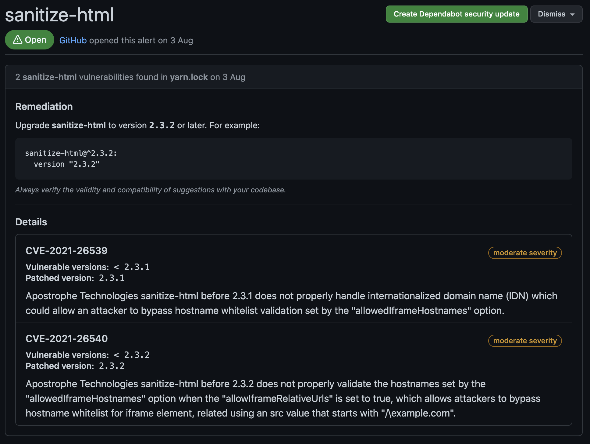
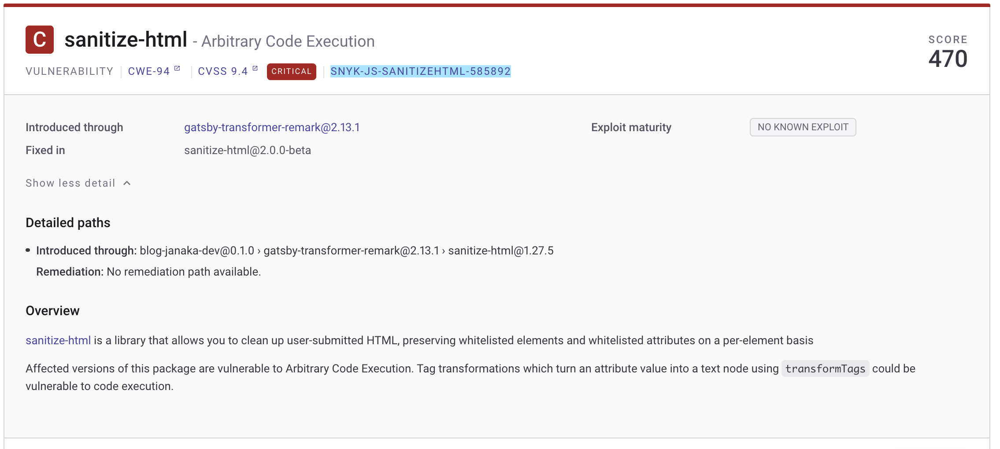

Generally the reason I switched to hosting my own site with Gatsby and play around with various software development tools and technologies is to learn the new. Importantly it also gives me a taste of the latest developer experience. Until recently I've not followed the InfoSec area, my focus has been elsewhere. I expect to learn a little more on the InfoSec front as well.

I've had Dependabot switched on for this blog ([repo](https://github.com/janaka/blog-janaka-dev)) for a while. I wanted to see a) if it would encourage me to keep the software up-to-date, and b) how easy does it make remediation.

This mode of thinking totally applies to commercial software development. Maintenance is absolutely a necessary part of the software life cycle. But the objective is to minimise this burden so teams can focus on delivering new value to customers.

This isn't going to be a comprehensive analysis. Rather, some notes on what I learn, experience, and observe.

**Disclaimer: This is a naive comparison.**

## High-level

Snyk and Github provide the same code vulnerability detection and remediation functionality. They detect issues with your code and dependencies.

- Github
  - Dependabot (dependencies) + Code Scanning (your code). Code scanning can be performed by multiple tools. Github CodeQL Analysis + third-party scanning tools. Side note: Dependabot and CodeQL Analysis are acquisitions IIRC.
  - No Infra-as-Code (IaC) scanning. But I assume this will come, It's another lang for CodeQL.
  - No container image scanning. I assume this will come at some point.
- Snyk
  - Snyk Code (your code) + Snyk Open Source (dependencies).
  - Snyk also supports container image scanning and Infra-as-Code (like Terraform) scanning. Not sure if the latter is dependency and code also.

## Setup

- Github
  - Dependabot: I can't remember what I did exactly but IIRC it was very easy. Check a couple of boxes and click and enable button.
  - Code Scanning (CodeQL): involves adding a GH Action Workflow to the repo. A wizard in the web UI guides you though adding the YAML file (I accepted the default), then creating and merging the PR.
- Snyk
  - Sign up for a Snyk account. I used by Github account and was smooth. I do count this as an additional step even thought technically one needs to create a GH account if going from scratch. But typically ones would have a Github, Gitlab, or Bitbucket account forming he base of their development workflow.
  - I got the choice of giving perms to just public or public and private reports. I opted for the former for now. In following steps I was given the option to select which repos were to be scanned.
  - Completed the wizard and a scan was immediately kicked off.

## Scanning

- Github
  - Dependabot
    - seems to perform regular scans and pushes to the repo also trigger scans
    - No VS Code extension
  - Code Scanning (CodeQL)
    - VS Code extension is available for [CodeQL](https://marketplace.visualstudio.com/items?itemName=GitHub.vscode-codeql) but this seems optimised for CodeQL query development rather than vulnerability detection during the app dev workflow.
- Snyk
  - Auto scan on a daily or weekly frequency. Or manual trigger
  - I didn't time the initial scan. When I did a rescan on this repo today it was reasonably fast, again didn't time, but in the order or several minutes I feel.
  - I assume there's CI/CD integrations that can trigger scans
  - VS Code extension ([Snyk Vulnerability Scanner](https://marketplace.visualstudio.com/items?itemName=snyk-security.snyk-vulnerability-scanner)) should give feedback early in the dev lifecycle. Also faster feedback during the dev inner loop. Currently (v1.1.1) only supports Snyk Code. Extension description says Snyk Open Source support is coming out in Q3.

## Results

The results between the two are different not surprise.

- Github
  - Dependabot: 29 issues ( 2 critical, 14 high)
    - Snyk did pick up both these critical issues but scored them _high_
    - Did pick up the sanitize-html critical that Snyk reported
  - Code Scanning ( CodeQL): 0 issues

- Snyk
  - 46 issues (1 critical, 19 high)
    - picked up the sanitize-html critical which Dependabot did not. However the fix wasn't obvious. As the screenshot shows, there's no fix-this-vulnerability button. Reading closer shows it's a transient dependency of `gatsby-transformer-remark@2.16.1` which I assume hasn't upgraded the sanitize-html dependency yet.
    - There's priority score and severity score. Interestingly the critical has lower priority score. It seems like the maturity of the exploit determines the priority together with the CVSS score. The sanitize-html doesn't have a known exploit apparently.

## Applying Fixes

- Both have the create PR with fix feature.
- For whatever reason Snyk doesn't do this for every issue.
- Both create several PRs which makes sense. However it also makes it a little mentally hard to parse through and decide which order to apply. Maybe it doesn't matter most of the time. But I do not yet trust that there aren't going to be conflicts.

## Final Thoughts

Github Dependabot and Code Scanning are obviously integrated into the Github UI which is ideal. However, at this time the gain seems to be marginal. At least for my one off use case test. Snyk does seem to be more comprehensive feature wise. And the scanning itself seems to catch vulnerabilities more completely. But I'm no expert on this front and haven't analysed deep enough to see if the difference is meaningful. I'm going to see how the two compare overtime while I'll stick to only applying issues reported by Snyk.

## Learnt

- CWE ([Common Weakness Enumeration](https://cwe.mitre.org/index.html)) A Community-Developed List of Software & Hardware Weakness Types
- CVSS ([Common Vulnerability Scoring System](https://www.first.org/cvss/))

