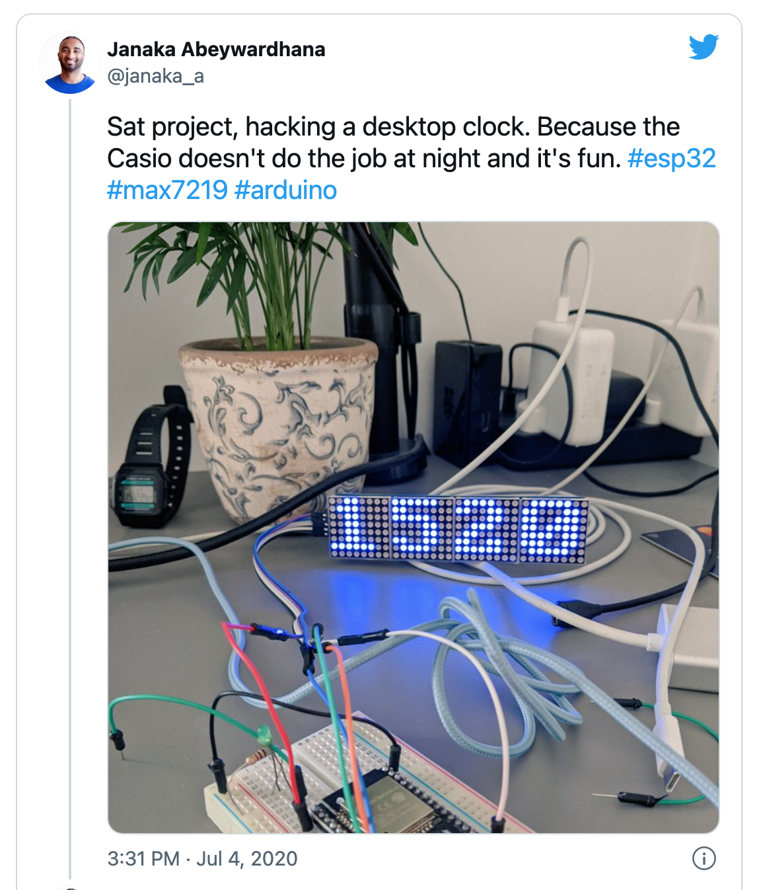

A couple of years back I built this digitial desktop clock. It was mainly for fun but it was July 2020, we were mid pandemic and working from home. I was using a little Casio wrist watch as desktop clock. It sort of did the job but the digits were small and wasn't readable at night, I like dim lighting. So that was my "real" use case.



I'd been hacking around with Arduino for a few years before this. At first using the original boards but then I came across the [ESP](https://www.espressif.com/) boards. First the ESP8266 which was great but the network stack was limitd. For example didn't support the newer versions of TLS so working with the likes of AWS IoT wasn't great. IIRC memory was also too limiting for use cases making external calls. Then came the ESP32 which is the platform I've been using lately - I'm still using the original release there have been a few iterations with more features. This clock is the only hardware related side-project I have going for the last couple years.

I've been hacking on this clock project here and there. To be honest the only time I needed to update it's firmware is to adjust the daylight saving offset. After doing it three times manually I decided to automate it. The simplest solution would have been to add a physical switch to toggle. But I decided I wanted to take the relatively more complicated route just for the challenge.

_So what's the big deal?_ I hear you ask.

The ESP32 doesn't have a built-in RTC and my design doesn't use an RTC module. I cannot remember why exactly but I suspect that on the weekend I decided to build I wanted  an initial version up and running within a few hours so used hardware and code I already had to hack - it's still held together by a breadboard and jump leads as seen in the photo :). Time is sync'd from Internet time servers on boot up and then once per day to handle drift. So there's no daylight saving functionality built into the hardware or standard libs. I also have a few requirements: 1) overall optimise for minimal power usage 2) minimise third party libs, the ones I found seem to do more than just calculate if it's BST or not. 3) minimise external network calls to save power and avoid the extra service binding code. Really it didn't seem worth an service call for something that should be fairly simple to handle locally.

Honestly, if I found code on the web I could copypaste, I would have. I didn't find something obvious so "invented" it myself. Highly likely there's a more efficient way of doing this but this does the job as a first iteration. One day I might optimise, again just for fun.

Here's the snippet. See the [repo](https://github.com/janaka/desktop-clock/blob/master/src/sketch.ino/sketch.ino) for complete code and details.

```C++
unsigned int tm_mon = (unsigned int)ti.tm_mon; // month 0=Jan,1=Feb,2=Mar,3=Apr,4=May,5=Jun,6=Jul,7=Aug,8=Sept,9=Oct,10=Nov,11=Dec
  unsigned int tm_mday = (unsigned int)ti.tm_mday; // date 
  unsigned int tm_wday = (unsigned int)ti.tm_wday; // day of week 0=Sun,1=Mon...6=Sat
  Serial.print("mon=");
  Serial.print(tm_mon);
  Serial.print(", mday=");
  Serial.print(tm_mday);
  Serial.print(", wday=");
  Serial.println(tm_wday);

  // Self contained UK daylight saving algo. 
  // Not accurate to the hour of change which is good enough for me. 
  // i.e. switch at 12am rather than BST at 1am and into GMT at 2am. 
  // Use at your own risk 
  if (tm_mon>2 && tm_mon<9) {
     // Apr-Sept is BST for sure  
     daylightOffset_sec= 3600;
     Serial.println("cond1");
  } else if (tm_mon==2 && tm_mday>24 && (tm_mday+(7-tm_wday)) > 31) {
    // BST starts last Sun in March. Cover last Sun to 31st. Earliest Sun is 25th.  0 = Sun. 2 = Feb 
    Serial.println("cond2");
    daylightOffset_sec= 3600;
  } else if (tm_mon==9 && ( tm_mday<24 || (tm_mday+(7-tm_wday)) < 32 )) { 
    // BST ends last Sun in Oct. Cover to the last Sun. Earliest Sun is 25th. 0 = Sun. 9 = Oct
    Serial.println("cond3");
    daylightOffset_sec= 3600;
  } else {
    Serial.println("catch all");
    daylightOffset_sec = 0;
  }

  Serial.print("after logic, daylightOffset_sec=");
  Serial.println(daylightOffset_sec);
```
