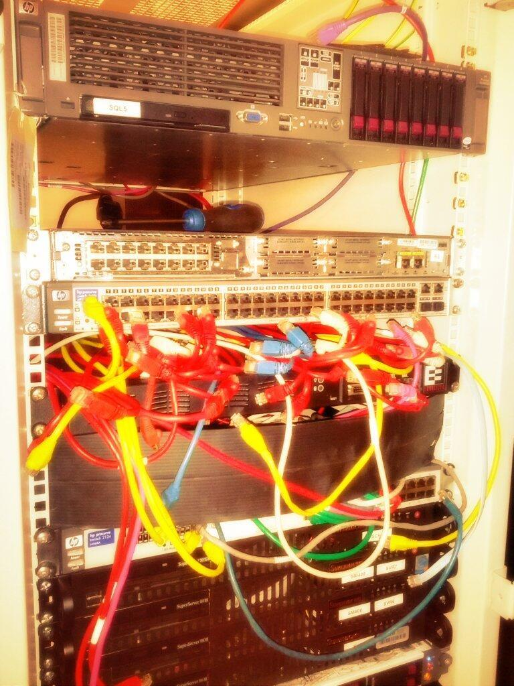
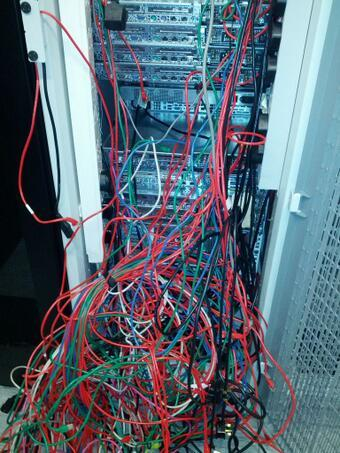
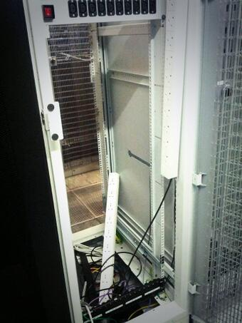

This is one of those promises I made to myself, approximately 5 years ago. I had long since realised that if they can’t see it, they don’t really care. They don’t care until it goes wrong that is. Therefore spending time on what mattered to my colleagues and our customers and outsourcing the rest became the strategy. I’m pretty sure this isn't revolutionary thinking but how does one execute is always the question, right?  
  
Outsourcing is a concept that had been around for many years but 2009 was different. It was different because cloud computing was starting to gain traction. This method of out sourcing thoroughly suited us. And there started our cloud-first strategy.  
  
Yesterday marked a significant milestone in this journey. We pulled the plug on the final major piece of legacy infrastructure. We decommissioned the final rack in the old data centre which to be honest has largely been a very expensive storage cupboard for the last few years.  
  
In everything we do I ask the question “Would our customers care?” “How much value would this add to our customer?”. I believe we are now firmly into the second iteration. Seeking to push higher up the stack, IaaS to PaaS to SaaS.  

Celebrate, it's all gone!

Addition 23 Jan 2021: This rack was located in a [Colt](https://www.colt.net) data centre, Wapping, London, UK.
