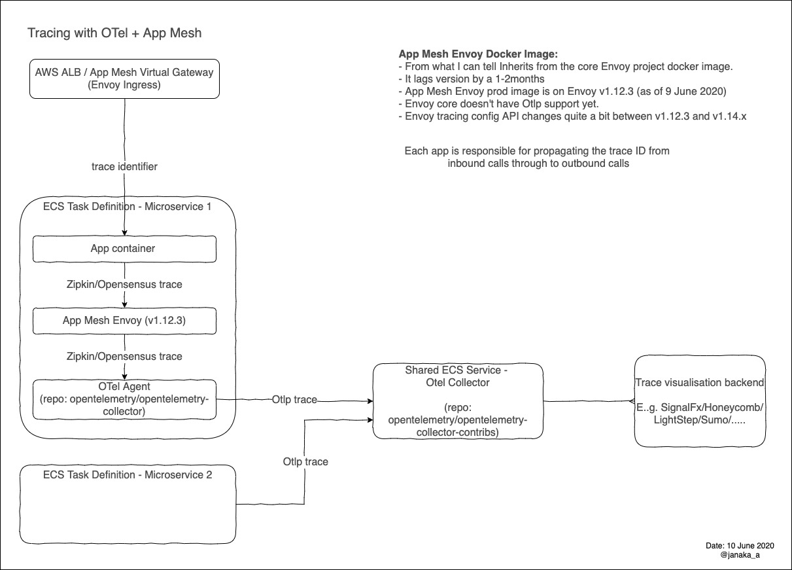

As of this writing [OpenTelemetry](opentelemetry.io) is still in beta. There isn't a lot of writing about it yet. Official docs are minimal, especially if you are in .NET Core land. Now throw AWS App Mesh and Fargate into the mix and we are in for a fun ride. Here are notes on what I learnt by messing around with it in a sandbox.

- Ideally we would want to use Otlp (OpenTelemetry Protocol) as the export format in the app. But Envoy doesn't support that yet.
- Envoy tracing config changes in newer Envoy versions. App Mesh Envoy is about 2 versions behind right now (1.12.3).
- Managing the Envoy tracing config like this isn't ideal. Envoy version upgrades will involve changes to the tracing config. Appreciate the App Mesh team providing this escape hatch but I'd hope they add first class support. Not having to manually manage Envoy config is one of the main benefits of App Mesh.
- The Otel .NET SDK is very immature and APIs are very unstable. They are upfront about this. It's still in Alpha. It's also behind the Golang and maybe Java SDK. The differences in Zipkin vs Otlp are shown below in an example. It sounds like there'll be a significant refactor soon and some bits getting pushed into .NET BCL. Aaron from Petabridge wrote more about all this [here](https://petabridge.com/blog/state-opentelemetry-dotnet/) and concluded that it's about a year out still.
- The pipeline architecture of the collector/agent is really nice. Allows one to config multiple pipelines of receivers, processors, and exporters. This makes it easy to send traces to multiple backends and options for switching out. Makes vendor evaluation easier and cheaper. Without cost should also be low.
- Agent vs Collector - the naming is poor, they are both collectors by function. The name describes the mode it runs in.
  - Agent: runs next to the app e.g. sidecar. This will be the core collector. See [code repo](https://github.com/open-telemetry/opentelemetry-collector). It supports only vendor agnostic protocols like Zipkin or OTLP (OpenTelemetry Protocol).
  - Collector: Runs stand-alone and aggregates traces from several agents then sends to a backend like Zipkin (self-hosted) or LightStep (cloud). This will be the collector with vendor protocol contributions. See [code repo](https://github.com/open-telemetry/opentelemetry-collector-contrib). 
  - Official docs say "Agent is capable of adding metadata" and "can offer advanced capabilities over the Agent including tail-based sampling". This implies that there are functional differences between the two binaries.
  - See the official explanation [here](https://opentelemetry.io/docs/collector/about/).

## High-level view



The agent + collector setup is [recommended by OTel](https://opentelemetry.io/docs/collector/about/).

## Important Config Snippets

I'll link to the working example source code in the future.

startup.cs for zipkin protocol.

This code propagates trace IDs on outbound calls

```csharp
using OpenTelemetry.Trace.Configuration; 

public void ConfigureServices(IServiceCollection services)
{
    services.AddControllers();

    services.AddOpenTelemetry((sp, builder) =>
    {
        builder
            //.SetSampler(Samplers.AlwaysSample)
            
            .UseZipkin(options =>
            {
                options.ServiceName = "hello-world-api";
                options.Endpoint = new Uri(zipkinEndpoint);
            })
            .AddRequestAdapter()
            .AddDependencyAdapter(); 
    });
}
```

At present the API for Otlp is a little different.

```csharp
  // ref https://github.com/open-telemetry/opentelemetry-dotnet/blob/master/src/OpenTelemetry.Exporter.OpenTelemetryProtocol/TracerBuilderExtensions.cs
  services.AddOpenTelemetry((sp, builder) =>
   {
       builder
           .SetResource(Resources.CreateServiceResource("hello-world-api"))
           .UseOpenTelemetryProtocolExporter (options =>
           {
               options.Credentials = ChannelCredentials.Insecure;
               options.Endpoint = otlpEndpoint;
           })
           .AddRequestAdapter()
           .AddDependencyAdapter(); 
  });
```

Create a custom App Mesh Envoy image with the override config because it's the easiest way on Fargate. Not ideal for production.

Envoy (v1.12.3) override config `envoy-otel-tracer-config.yaml`

```yaml
tracing:
  http:
    name: envoy.zipkin
    typed_config:
      "@type": type.googleapis.com/envoy.config.trace.v2.ZipkinConfig
      collector_cluster: otel-agent
      collector_endpoint: "/api/v1/spans"
      #collector_endpoint: "/api/v2/spans"
      #collector_endpoint_version: HTTP_JSON

static_resources:
  clusters:
  - name: otel-agent
    connect_timeout: 1s
    type: strict_dns
    lb_policy: round_robin
    load_assignment:
      cluster_name: otel-agent
      endpoints:
      - lb_endpoints:
        - endpoint:
           address:
            socket_address:
             address: 127.0.0.1
             port_value: 9411
```

```dockerfile
FROM 840364872350.dkr.ecr.us-west-2.amazonaws.com/aws-appmesh-envoy:v1.12.3.0-prod
COPY envoy-otel-tracer-config.yaml /tmp/envoy-otel-tracer-config.yaml
```

Env var that tells the App Mesh Envoy container to use the tracing override config file. The complete task def has 3 containers defs: 1) the app 2) App Mesh Envoy 3) OTel agent.

```json
  {
    "name": "ENVOY_TRACING_CFG_FILE",
    "value": "/tmp/envoy-otel-tracer-config.yaml"
  }
```
